# Praat 元音标注操作规范 v1.1

## 工作概述

我们为语音数据集中的元音和辅音进行了时间区间的自动标注，并筛选出了元音的部分。你需要完成的工作是为自动标注的元音区间进行人工校对。

**请完整阅读该文档后再开始校对工作**。

## 基本指南

### 软件安装

下载对应 OS 版本的 Praat。一般来说是 Windows 64-bit，如果你的电脑是 ARM64 架构的处理器就下载 arm64 版本。

[下载地址](https://www.fon.hum.uva.nl/praat/)

### 待标注数据集结构

你应该会拿到一个名为 `group_{i}.zip` 的压缩文件。在此文件中，可能会有 `depressed`、`healthy_0`、`healthy_1` 这三个目录中的几个。这是数据集的三个子集。

不过，子集的名字不重要。你需要知道的是，每个子集中又有若干个形如 `A0001` 的目录，每个这样的目录都代表一个实验参与者，目录中保存有参与者录下的音频（.wav）以及标注文件（.TextGrid）。

在压缩文件的根目录中，除了子集以外，还有一个名为 `check.md` 的 Markdown 文档，里面对每个参与者都有一个勾选框。你每完成一个参与者的校对工作，就勾选对应的选项。

### 读取文件的方法

安装并打开 Praat 后，会出现两个窗口 `Praat Objects` 和 `Praat Picture`。

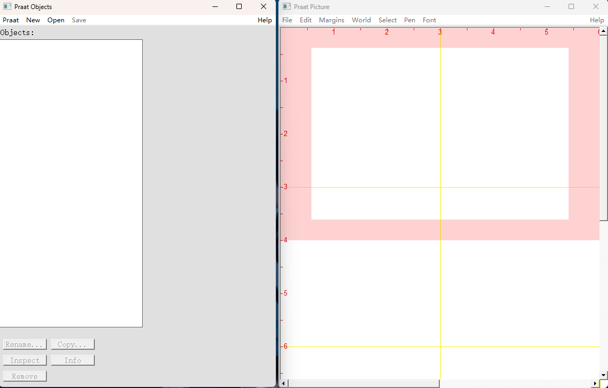

先不用管 `Praat Picture`，来看 `Praat Objects`。

上方有 4 个下拉菜单，分别是 `Praat`, `New`, `Open`和`Save`。我们现在暂时只需要关心 `Open`。

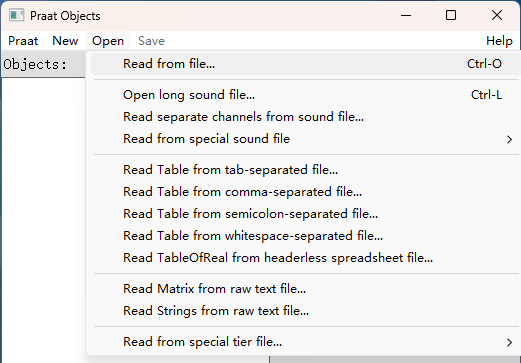

在这里，可以通过 `Read from file...` 来导入 `wav` 文件或 `TextGrid` 文件。

标注工作需要同时读入音频文件与`TextGrid`文件。读入匹配的两个文件后，通过按住 `Ctrl` 同时选中两个对象，然后点击右侧的 `View & Edit` 即可开始编辑。

进去的时候可能会跳一个警告，提示字体缺失，这个不用管。

### 预备知识

> Q: 什么是共振峰？
> A: 共振峰（Formant）是人类声音中的一种声学特征。当声波通过声道（口腔、鼻腔等）时，某些特定频率被放大，形成频谱中的能量峰值，这些峰值频率称为共振峰。
> 在 Praat 中，共振峰以语谱图上的红点表示。
> 
> 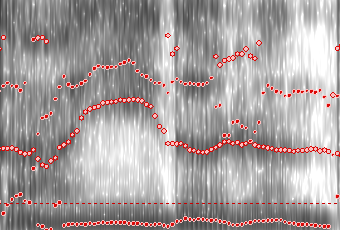
> 
> **理想情况下**，会有四条散点连成的线，自下而上分别称为 F1、F2、F3、F4。

### 软件设置

#### 输出格式设置

为了方便后期处理，在保存文件前，你需要先设置 Praat 的文本输出格式为 UTF-8。

找到 `Praat Objects -> Praat -> Settings -> Text writing settings`，选择编码格式为 `UTF-8`，然后点击 `OK` 即可。

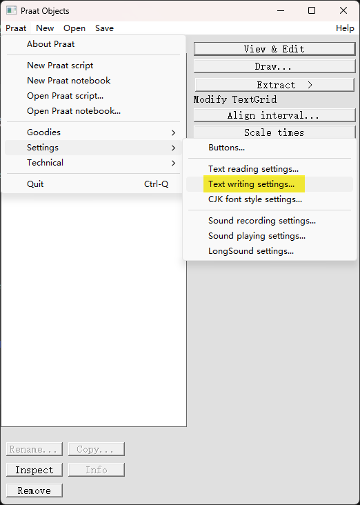

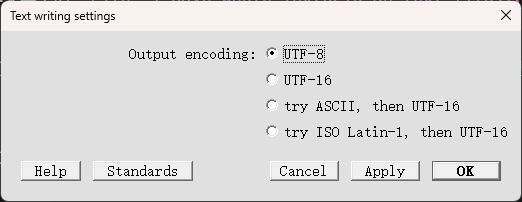

#### 音高与强度

开启音高和强度显示，辅助元音稳定段判断。

在上方菜单找到 `Pitch -> Show pitch` 打开音高显示。

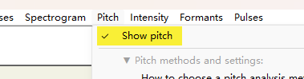

在上方菜单找到 `Intensity -> Show intensity` 打开强度显示。

#### 共振峰设置

在上方菜单找到 `Formants -> Show formants` 打开共振峰显示。

再在上方菜单中找到`Formants -> Formant settings...`。

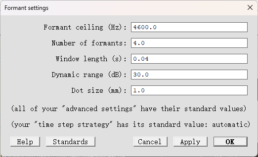

推荐设置为：

- Formant ceiling
  - 男性：最高 4000Hz
  - 女性：最高 4600Hz
- Number of formants：`4.0`
- Window length：`0.04`

Formant ceiling 可进行微调，只要尽可能让频谱图中的共振峰曲线清晰分明即可。曲线质量参考下图：

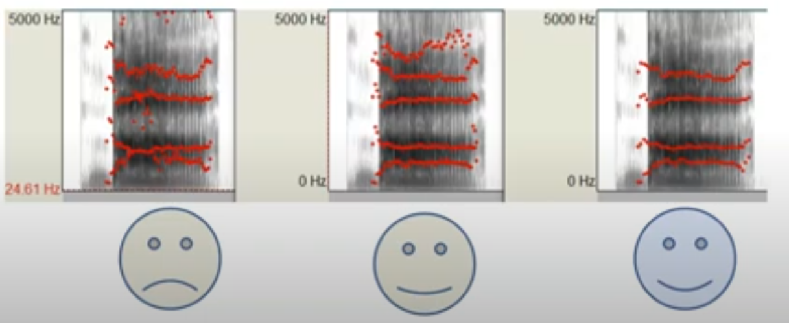

### 标注界面操作方法

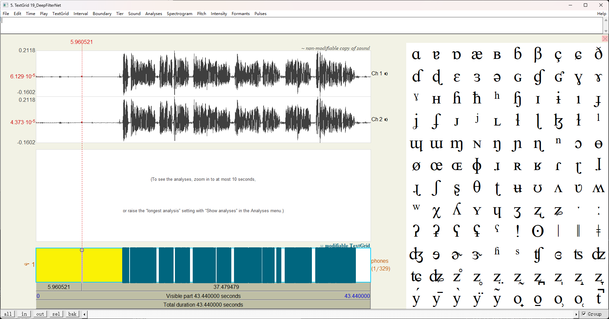

进入编辑界面可以看到，上方出现了音频的波形图，中间暂时什么也没有，下方是现有的标注。右侧是用于音素标注的若干国际音标，我们不需要管这个。

> 可能因为未知 bug 导致左下角的按钮 UI 有部分看不见，暂时没有修复方法，有时自己就好了。

选中一段波形，点击左下角的 `sel` 按钮即可专注于这部分音频。

> 其它几个按钮：
>
> - `all`：视野拉到整段音频
> - `in`：放大
> - `out`：缩小
> - `bak`：返回。在多次使用`sel`时很好用。
>
> 如果没有看到共振峰，就在上方菜单找到`Formants -> Show formants`并选中。

可以更清晰地看到下方已经有若干标注。其中没有文字的区间为自动标注的空白段，空白段表示这一段为非元音段。

放大后，可以看到这里已经标注了元音 `i` 。按住边界拖动即可调整这段标注的开始时间和结束时间。

> 快捷键`Ctrl+Z`可能无法使用。如果出现这种情况，可以通过在上方 Edit 中找到撤销选项来撤销。
>
> 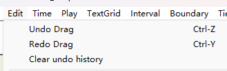

### 如何判断元音稳定段

标注时应该标注元音稳定段。那么什么是元音稳定段呢？

> **稳定段（或核心段）**：这是元音的主要部分，声音相对平稳，音高、音质等特征变化较少，通常持续的时间较长。稳定段是分析元音的核心部分，也是标注元音时最常标注的部分。
>
> 在进行元音标注时，稳定段通常是指元音发音中最"平稳"或最"恒定"的部分。这一段通常用于描述元音的特征，如音高（F0）、音质（共振峰）等。对于元音的稳定段标注，您通常会选择音频中变化较小且没有明显过渡或衰退的部分进行标注。

简单来说，就是元音发音最稳定的部分。可以看下图，这个 `a` 的波形图看起来就很稳定，振幅变动很小。

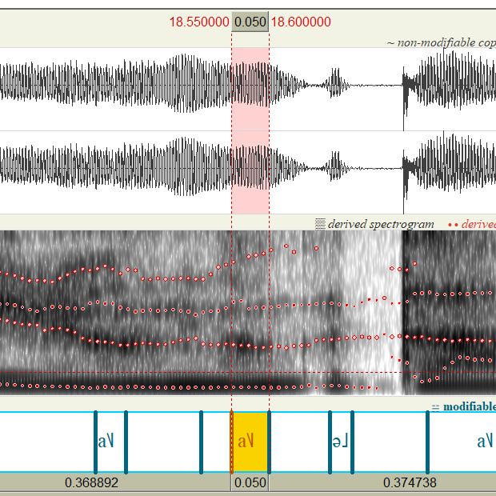

而像下面图中这种标注就不行。这个 `a` 虽然音高稳定，但波形图后半部分渐弱，而且前半部分 F1 共振峰变化大。

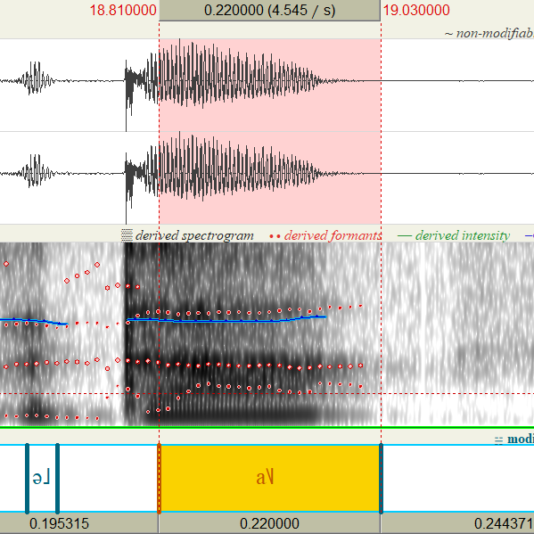

这里就根据共振峰，截掉 F1 的爬升阶段，再根据语谱图和波形图，选取中间的稳定段。

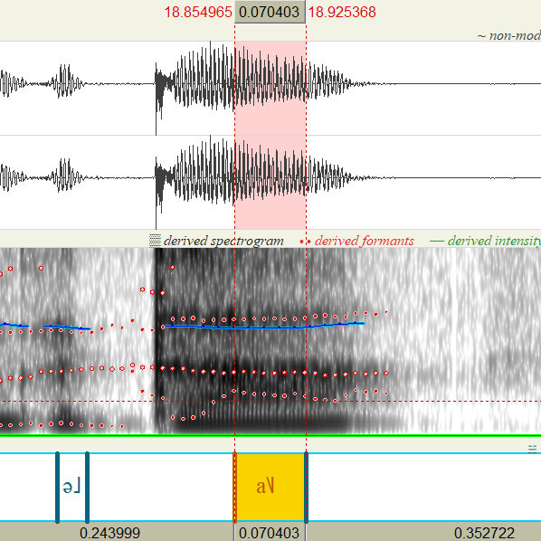

### 添加区间边界的方法

下面用一个例子来说明怎么添加区间边界。如下图所示，`ow` 和 `i` 相邻，假如我想要缩小 `ow` 的区间段，但是如果直接调整右边界就会导致 `i` 的区间增大，这种时候就应该添加新的边界。

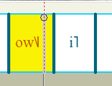

首先选中想要添加边界的时间点，找到上方菜单 `Interval` 中的 `Add interval on tier 1` 即可添加边界。或者，如果快捷键有效的话，可以尝试使用 `Ctrl+1`。

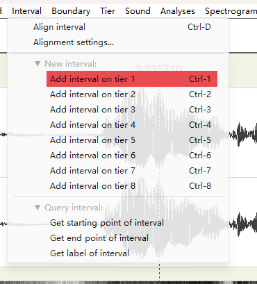

另一种方法是点击这个圆形标记，也可以添加边界。

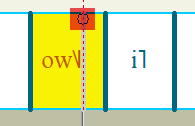

### 保存文件的方法

完成标注校对后，选择菜单中的 `File -> Save whole TextGrid as text file...` 保存标注文件。文件名不要改动，覆盖原文件即可。

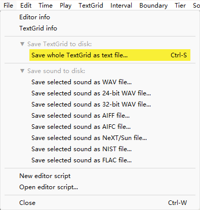

### 移除文件的方法

保存校对完成的标注文件后，你需要先移除之前加载的文件，再加载新的文件。如下图所示，选中文件后，点击左下角的 `Remove` 按钮即可。

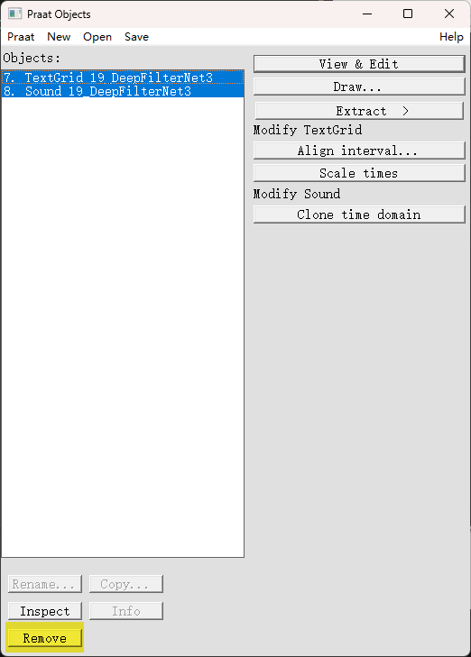

### 提交文件的方法

当你完成所有参与者的标注校对工作后，请你将校对后的文件重新压缩为 `zip` 文件，发送到邮箱 ..@gmail.com](mailto:/..@gmail.com?subject="Group%201%20校对完成")。

请保留原本的数据集结构打包发送给我，感谢你的配合。

### 工作流程

打开 Praat 后，重复以下流程：

1. 选择一个未校对的参与者，导入其 `wav` 音频与 `TextGrid` 文件到 Praat 中
2. 为该参与者调整共振峰设置
3. 对每段指定元音（i, y, a, u, o）的区间进行校对，选择元音稳定段
4. 保存校对完成的 `TextGrid` 文件
5. 移除校对完成的文件
6. 在 `check.md` 中对完成的参与者进行勾选

### 常见问题

[常见问题](./problems.html)

## 标注要求

1. 仅校对 i, y, a, u, o 这五个元音
2. 对比下方标准文本，检查每一个字是否自动标注。如果没有自动标注则需要手动添加。
3. 时长标准：最小标注区间时长 10ms，最大标注区间时长 70ms

## 标注文本

> 有一次，北风和太阳正在争论谁比较有本事，他们正好看到有个穿着大衣的人走过，他们就说，谁可以让那个人脱掉那件大衣，就算谁比较有本事。于是*北方*开始拼命的吹，怎知他吹得越厉害，那个人就越是用大衣包紧自己，最后北风没办法就放弃了，接着太阳出来晒了一会儿，那个人感觉变得很热，立刻把大衣脱掉了，于是北风只好认输了。
>
> （PS 这里的*北方*是收集数据时提供的文本中出现的错误。可能会有一些参与者读的时候修正为*北风*。）

目的是校对 i, y, a, u, o（衣、于、啊、乌、哦）五种元音的标注区间，将其调整到准确的位置。下面会用粗体把含元音的字标记出来，并附部分该元音的频谱图以供参考。

> 有**一**次，北*风*和太**阳***正*在*争*论谁**比**较有本事，**他**们*正*好**看**到有*个***穿***着***大衣**的人走**过**，**他**们就**说**，谁可**以让***那*个人**脱**掉*那*件**大衣**，就**算**谁**比**较有本事。**于**是北*方*开始**拼命**的吹，怎知**他**吹得越**厉**害，*那个*人就越是**用大衣**包**紧**自**己**，最后北*风*没**办法**就**放弃**了，接着太**阳出**来晒了**一**会儿，*那*个人**感**觉变得很热，**立***刻***把大衣脱**掉了，**于**是北*风*只好认**输**了。

### 含 i 的部分

> 有**一**次，北风和太阳正在争论谁**比**较有本事，他们正好看到有个穿着大**衣**的人走过，他们就说，谁可**以**让那个人脱掉那件大**衣**，就算谁**比**较有本事。于是北方开始**拼命**的吹，怎知他吹得越**厉**害，那个人就越是用大**衣**包**紧**自**己**，最后北风没办法就放**弃**了，接着太阳出来晒了**一**会儿，那个人感觉变得很热，**立**刻把大**衣**脱掉了，于是北风只好认输了。

参考谱图：

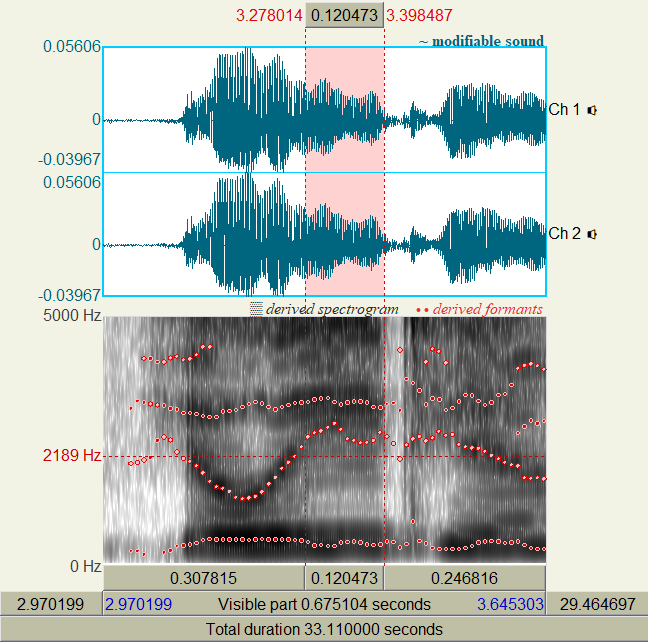

### 含 y 的部分

> 有一次，北风和太阳正在争论谁比较有本事，他们正好看到有个穿着大衣的人走过，他们就说，谁可以让那个人脱掉那件大衣，就算谁比较有本事。**于**是北方开始拼命的吹，怎知他吹得越厉害，那个人就越是用大衣包紧自己，最后北风没办法就放弃了，接着太阳出来晒了一会儿，那个人感觉变得很热，立刻把大衣脱掉了，**于**是北风只好认输了。

参考谱图：

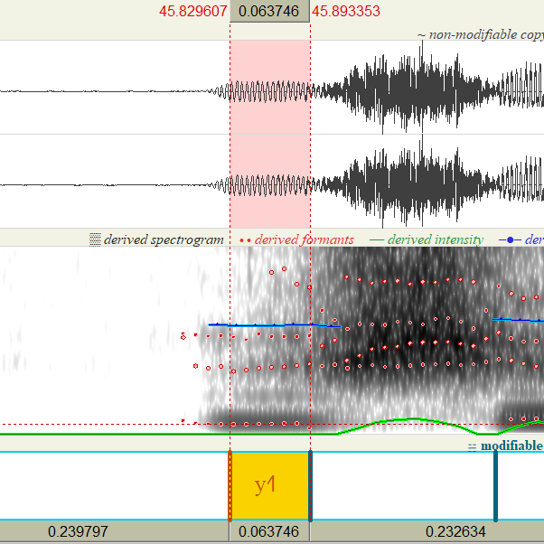

### 含 a 的部分

> 有一次，北风和太**阳**正在争论谁比较有本事，**他**们正好**看**到有个**穿**着**大**衣的人走过，**他**们就说，谁可以**让***那*个人**脱**掉*那*件**大**衣，就**算**谁比较有本事。于是北*方*开始拼命的吹，怎知**他**吹得越厉害，*那*个人就越是用**大**衣包紧自己，最后北风没**办法**就**放**弃了，接着太**阳**出来晒了一会儿，*那*个人**感**觉变得很热，立刻**把大**衣脱掉了，于是北风只好认输了。

参考谱图：

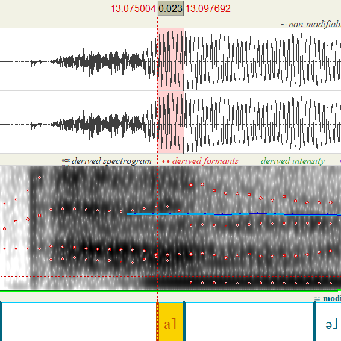

### 含 u 的部分

> 有一次，北风和太阳正在争论谁比较有本事，他们正好看到有个穿着大衣的人走过，他们就说，谁可以让那个人脱掉那件大衣，就算谁比较有本事。于是北方开始拼命的吹，怎知他吹得越厉害，那个人就越是**用**大衣包紧自己，最后北风没办法就放弃了，接着太阳**出**来晒了一会儿，那个人感觉变得很热，立刻把大衣脱掉了，于是北风只好认**输**了。

参考谱图：

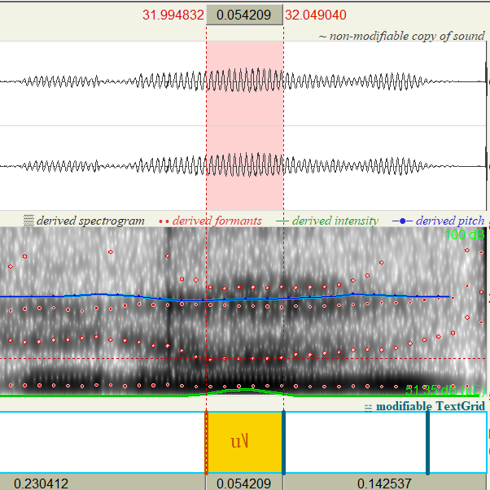

### 含 o 的部分

> 有一次，北*风*和太阳*正*在*争*论谁比较有本事，他们*正*好看到有*个*穿*着*大衣的人走**过**，他们就**说**，谁*可*以让那*个*人**脱**掉那件大衣，就算谁比较有本事。于是北*方*开始拼命的吹，怎知他吹得越厉害，那*个*人就越是用大衣包紧自己，最后北*风*没办法就放弃了，接着太阳出来晒了一会儿，那个人感觉变得很热，立*刻*把大衣**脱**掉了，于是北*风*只好认输了。

参考谱图：

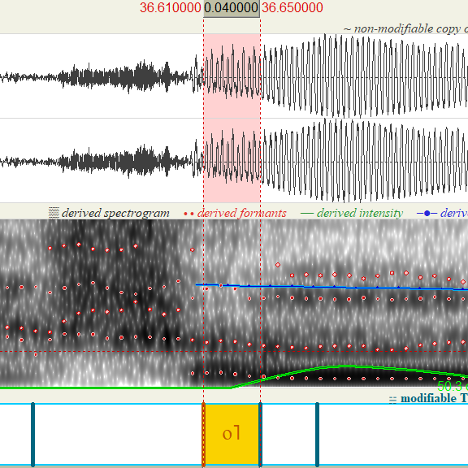

### 关于口音

可能出现口音区别的字在上方文本中用斜体表示。

- “那个”在口语中常常发音成“内个”，需判断“那”是否为 na。
- 有的人会把 e 发成 o，比如“可以”说成“阔以”，“着”说成 zhuo。需要判断是否为 o。
- 风可能读成 feng 或者 fong。如果你分不清楚，可以当成都是 fong。

## 质量控制

1. 时长标准：最小标注区间时长 10ms，最大标注区间时长 70ms
2. 交叉检验：选择小部分样本多人标注，要求边界误差 $\leq$ 10ms
