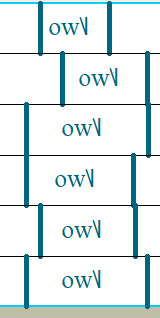
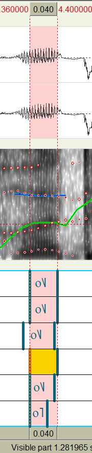

# 典型错误

此文档针对 depressed 子集 A0012 19_DeepFilterNet3.wav 音频。

## 不需要管 i, y, a, u, o 以外的元音

比如 ej 这个音就不用调它。这个属于双元音。

ow 虽然和有个 o ，但也是双元音，不用管。

e 虽然是单元音，但不在校对的范围内，也不用管它。

**只需要调整特定单元音，也就是字母部分只包含 i, y, a, u, o 的部分。**

## 元音的语谱图通常 F1 很明显

元音部分的F1通常集中在低频，有明显的又黑又粗的块。图里第2行和第6行是标错了，这里不是o，而是后面的ng。

## 自动标注可能标错

这里能听到读的是**和(he)**，但自动标注似乎按照**和(huo)**去处理了。因为e不需要处理，所以这里直接删掉就好。

在校对区间的时候应该以听为主，先判断标注结果是否正确，再考虑调整区间。

还有类似的情况，自动标注系统会误判读音。

这里虽然自动标的是o，但这里读的是**正(zheng)**，所以删掉。还有不要添加奇怪的字符啊。

虽然听出来不是o了很好，但是不要随便改成别的啊！不对的音就直接删掉就好，除非你很确定那是iyauo中的一种。

这个字是**热**，不知道为什么会标出个o的音出来，应当删掉。而且就算真的是o，这个也不能这样标，应该取稳定段。

## 注意选择稳定段

这个标的有点离谱了，后半段的共振峰明显频率在提高，前面一小段的 F3 也有点不稳定。选中间的比较好。

紧接着的 i 这一段，F3明显呈一个拱形，并不平稳，而中间的部分相对稳定。这里应该加一段空白在 a 和 i 中间，然后选择中间稳定段，大概中间三分之一就可以。

这里后半段不稳定就不要比较好。谱图中间也有一个明显的断层，对吧？

这个字是**说(shuo)**。图里划出来这一段是o，前面一小段是u。可以看出来从u到o的过渡中，F3和F4部分颜色会变得略深一些。这里整段o都比较稳定，可以选择整段，也可以选中间三分之一到二分之一的部分。从声音强度来看，是在缓慢变弱。选的时候尽可能选择中间的部分，而不是偏左或偏右。

但是像图里这种尾音部分就不要包进去，声音已经很弱了。

这一段整段都比较稳定，但后段声音渐弱。这里前三分之二有一个音调的变化，所以我们要么选前三分之一，要么选中间三分之一。我们优先选择中间段，而不是起始段。两段一起就不太好。选的时候听一下，尽量不要听到音调在变化。

还有注意不要额外添加字符啊。

这里注意到强度和波形图两个不稳定的地方，起始段和结束段都去除掉一些，选中间部分。

这个**放**字，图里标出来F1稍高的部分是a的主要部分，后面过渡到ng。之前说过元音的 F1 共振峰会明显黑粗，这里可以看出来，F2部分黑粗的就是a的部分。但是我们尽量选中间部分，去掉前后过渡段。

这里也是选中间稳定段。

## 注意区分开音

这个字是**过**，g, u, o的发音是相对分开的。这里图里这段就是前面段u太短了，标出来的o实际包含了很多u的部分。uo和o是能听出来差别的。

这个字是**让(rang)**。听一听能听出来，自动标的左边界还包含了一些r的部分。往右调调比较好。右边界包含了一些ng的部分，往左调调比较好。

这个**命**字，左边界稍微带一点m，右移一点比较好。

**一会儿**。这里是个儿化音，不是o。自动标注标不明白。其实直接删掉就好了。

这两个音之间有一个过渡段。中间隔开比较好。

## 自动标注可能有遗漏

这里就漏了两个音。加标注的时候可以不用管音后面的符号，那个是国际音标用来标声调的，我们不是很在乎声调。

注意比对文本的每个含元音的字，自动标注是否有标出来。
